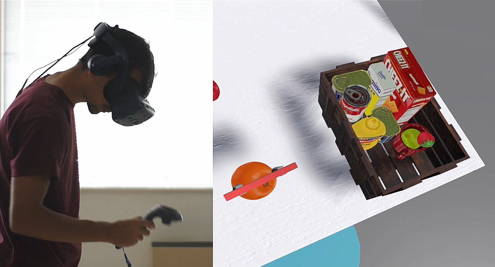

# Box packing with Everyday items Dataset

This dataset is a collection of human experts packing groceries into a box. 
BoxED was collected in Virtual Reality (VR) and captures many parameters of this task,
including 6-DOF pick-and-place grasp poses, object trajectories, packing sequence and more. 
This dataset enables learning models for multiple aspects of this task from humans, that generate human-like behaviors.

## How to use
In this [file](example.py) you'll find an example of how to import the dataset into the Python importer provided [here](boxed_importer.py).
This importer will load all the data into an object-oriented structure for easier use. Refer to its [documentation](boxed_importer.py)
for more details on how the data is saved and how you can use it.

Alternatively, you can simply use the data directly. Everything is stored in [this folder](Dataset).

## Dataset details
For a detailed overview of the contents of the dataset, collection procedure or purpose, please refer to [this thesisLINK]().

Alternatively, for a shorter overview refer to [this articleLINK]().